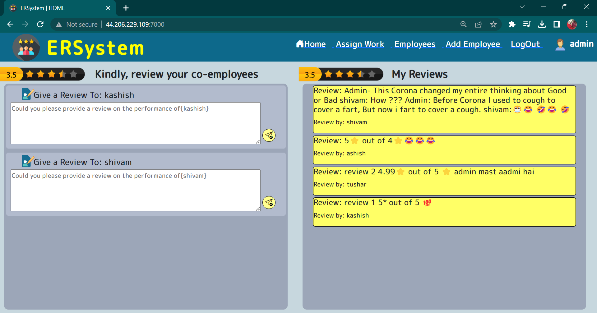
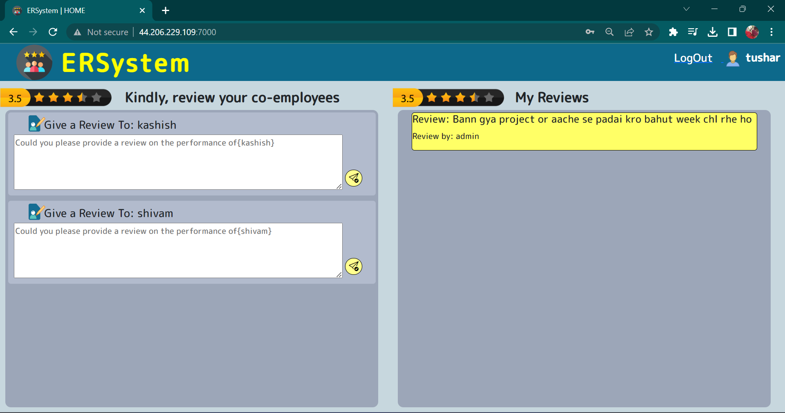
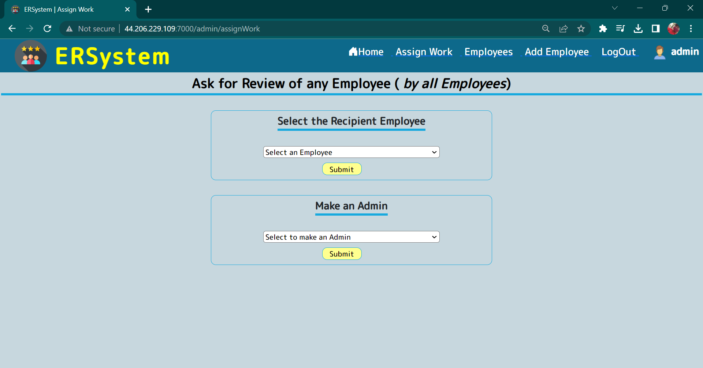
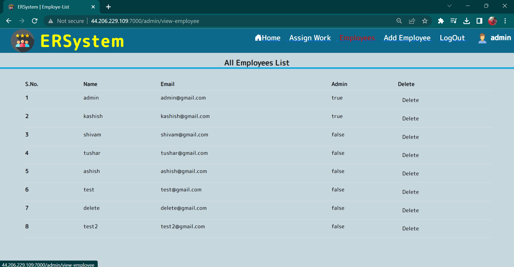

# Employee Review System [HOSTED LINK](https://ersystem-6kx5.onrender.com)

---

## Tech Stack

- Node.js
- Express.js
- MongoDB
- EJS
- JavaScript
- HTML
- CSS

## Description

The Employee Review System is a full-stack web application that facilitates the management of employee reviews. It empowers the admin to assign review forms to employees and gather feedback on their work performance and behavior within the organization.

### Admin Functionality[^1]

[^1]: #### login as admin by using
                email : admin@gmail.com
              pasword : admin

The admin has special privileges, including:

1. Assigning the role of an admin to any employee.
2. Adding new employees to the system.
3. Assigning review forms to employees.
4. Viewing a list of current employees.

Based on the reviews received, the admin can take appropriate actions regarding employee performance. All reviews given to employees are stored in a database for future reference and analysis.

### Home Page - Admin

The admin's home page provides a user-friendly interface with a navigation bar, allowing easy access to different sections of the application. The home page displays a list of review forms assigned by all admins to employees. On the right side, the admin can see reviews given by employees specifically for them, facilitating review monitoring and feedback management.



### Home Page - Employee

Employees have limited functionality and can only give reviews and view reviews given to them by other employees. The employee home page provides a simple interface for these actions.



### Assign Work Page (Add New Admin)

Only admins can access the "Assign Work" page, which allows them to assign review forms and designate new admins within the organization.



### Employee List Page (Can Delete Employees/Admins)

The employee list page displays a list of all employees and admins in the system. Admins have the ability to delete employees and other admins from this page.



The Employee Review System provides a comprehensive solution for managing employee reviews, empowering admins to make informed decisions based on feedback gathered from their team members.
---

### How to setup the project on local system

  1. Clone this project
     `git clone https://github.com/kapishverma/Employee_Review_System.git`
  2. Navigate to Project Directory.
      After reaching the project directory you have to run the following the command.
  3. install npm and all dependency `npm install`
  4. run this command `npm start`
---
  # User Schema

```javascript
  const UserSchema = new mongoose.Schema({
    name: {
        type: 'String',
        required: true
    },
    email: {
        type: 'String',
        required: true,
        unique: true
    },
    password: {
        type: 'String',
        required: true
    },
    isAdmin: {
        type: 'Boolean',
        required: true
    },
// this array of users objectId contain the list of all the list of review forms assigned
    userToReview: [{
        type: mongoose.Schema.Types.ObjectId,
        ref: 'User'
    }],
  // this array of posts objectId contain the list of all the list of reviews given to the current user  
    reviewRecivedFrom: [{
        type: mongoose.Schema.Types.ObjectId,
        ref: 'Review',
    }]
}, {
    timestamps: true
})
   ```
   ---
# Review Schema

```javascript
const reviewSchema = mongoose.Schema({
    content: {
        type: 'String',
        require: true
    },
    reviewTo: {
        type: mongoose.Schema.Types.ObjectId,
        ref: 'User',
        required: true
    },
    reviewBy: {
        type: mongoose.Schema.Types.ObjectId,
        ref: 'User',
        required: true
    },
    // reviewBy_name isliye kyuki agar user delete ho chuak hai to review bhi nahi rhega
    reviewBy_name: {
        type: 'String',
        require: true
    }
},
    {
        timestamps: true,
    })
```
